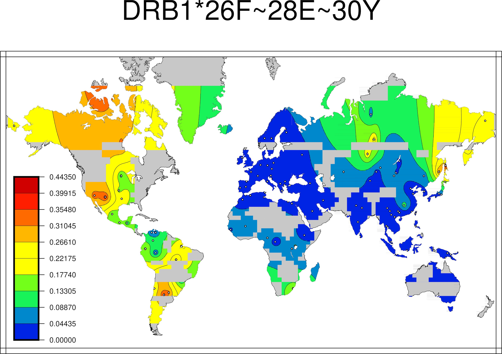

# User Guide for PHYCuS

## Vision

*A resource for global interpretation and analysis of HLA polymorphism.*

## General Ideas
We have implemented a Public Haplotype Frequency Curation Service (PHYCuS).  

Our specific goal is to provide a computational resource that will address unmet needs in the field for applications that consume HLA Haplotype Frequency data:

 - standard input formats for genotypes and output formats for haplotypes
 - standard representations of ambiguity (MAC, GL)
 - standard validation of HLA
 - globally unique IDs (GUIDs) to refer to "populations", "cohorts" and the one-to-many relationship between them
 - access control with appropriate licensing agreements
 - automated access (REST API not clickthrough pages)
 - quality metrics
 - standardized metadata
 

## Future capabiltites of PHYCuS

* Global visual of HLA with geographical distributions e.g. [haplostats.org](http://haplostats.org) maps but interactive
* Realtime analysis of population differences e.g. [nextstrain](https://nextstrain.org/ncov)* The ability to seamlessly navigate from HLA haplotypes to alleles to motifs to single amino acid polymorphims or even nucleotide sequence polymorophisms e.g. [SSHAARP](https://cran.r-project.org/web/packages/SSHAARP/index.html)

## Implementation of PHYCuS

The development of PHYCuS started with the definition of a [swagger specification](../curation-swagger-spec.yaml)

## Installation

See top level [README.md](../README.md)

